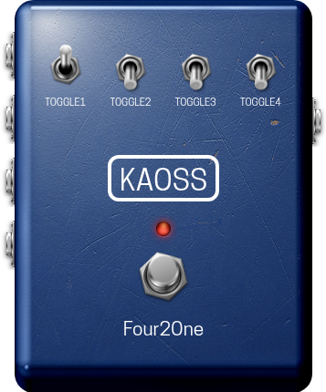

# Four2One – LV2 4-Channel Mixer/Selector

**A simple utility plugin that mixes four audio inputs into a single output, optimized for the MOD Audio platform.**

<p align="center">
  
</p>

---

## Features

*   **4-to-1 Mixing:** Combines up to four separate audio sources into a single mono output.
*   **Individual Channel Control:** Dedicated toggle switches for each input channel allow for quick muting and unmuting of sources.
*   **Selectable Mix Law:** Choose between "Sum" and "Equal Power" mixing behaviors to suit different signal types and gain staging requirements.

---

## Controls Usage

*   **Toggle 1 - 4:** These switches enable or disable the corresponding input channel (`In1` through `In4`). When a toggle is ON (handle up), that channel is active and passed to the mix. When OFF (handle down), the channel is muted.
*   **Mix Law:** Determines how the active signals are combined:
    *   **Sum:** Simply adds the signals together. This can lead to increased volume if multiple hot signals are active.
    *   **Equal Power:** Attenuates the signals based on the number of active inputs to maintain a relatively constant output level, preventing clipping when adding more sources.

---

## Installation

For most users, it is recommended to download the pre-built plugin from the **[Releases Page](https://github.com/theKAOSSphere/four2one/releases)**.

1.  Go to the [Releases Page](https://github.com/theKAOSSphere/four2one/releases).
2.  Download the latest `kaoss-four2one.lv2-vx.x.tgz` file.
3.  Unzip the file. You will have a folder named `kaoss-four2one.lv2`.

### For MOD Audio Devices

1.  **Transfer the Plugin:** Copy the entire `kaoss-four2one.lv2` directory from your computer to your MOD Audio device. You can use `scp` for this:
    ```bash
    # Example command from your Downloads folder
    scp -r ~/Downloads/four2one.lv2 root@192.168.51.1:/data/plugins/
    ```
2.  **Restart the Host:** Connect to your device via `ssh` and restart the `mod-host` service:
    ```bash
    ssh root@192.168.51.1
    systemctl restart mod-host
    ```
3.  **Refresh the Web UI:** Reload the MOD web interface in your browser. Four2One should now be available.

### For Linux Desktops

1.  **Copy the LV2 Bundle:** Copy the `kaoss-four2one.lv2` folder to your user's LV2 directory.
    ```bash
    cp -r ~/Downloads/four2one.lv2 ~/.lv2/
    ```
2.  **Scan for Plugins:** Your LV2 host (e.g., Ardour, Carla) should automatically detect the new plugin on its next scan.

---

## Building From Source

<details>
<summary><strong>► Build for MOD Audio Devices (using mod-plugin-builder)</strong></summary>

This project is configured to be built using the **`mod-plugin-builder`** toolchain.

#### Prerequisites

1.  A functional **MOD Plugin Builder** environment.

#### Build Steps

1.  **Clone the Repository:**
    Place the `four2one` repository inside the `plugins/package` directory of your `mod-plugin-builder` folder.
    ```bash
    cd /path/to/mod-plugin-builder/plugins/package
    git clone https://github.com/theKAOSSphere/four2one
    ```
2.  **Run the Build:**
    Navigate to the root of the `mod-plugin-builder` and run the build command, targeting `four2one`.
    ```bash
    cd /path/to/mod-plugin-builder
    ./build <target> four2one
    ```
    Replace `<target>` with your device target (e.g., `modduox-new`). The compiled bundle will be located in the `/path/to/mod-workdir/<target>/target/usr/local/lib/lv2` directory.

</details>

<details>
<summary><strong>► Build for Linux Desktop (Standalone)</strong></summary>

For testing on a standard Linux desktop without the MOD toolchain.

### Prerequisites

You must have the necessary development libraries installed (e.g., `lv2-dev`).

### Build Steps

1.  **Navigate to the Source Directory:**
    ```bash
    cd source/
    ```
2.  **Compile the Plugin:**
    ```bash
    make
    ```
    A `kaoss-four2one.lv2` bundle will be created inside the `source/` directory. You can then follow the desktop installation instructions to copy it to your LV2 folder.

</details>

---

## License

This plugin is licensed under GPLv3. See the `LICENSE` file for details. The project contains the `SPDX-License-Identifier: GPL-3.0-or-later` header in the source files.